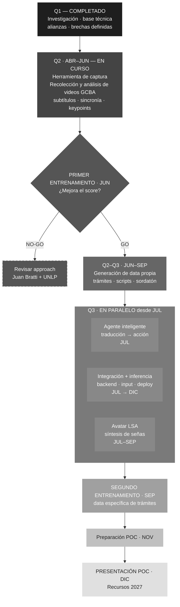

# Avatar AI — Roadmap 2026

---

**Leyenda de grises**

| Tono | Etapa |
|---|---|
| Negro `#1e1e1e` | Completado |
| Gris oscuro `#444–#555` | En curso (Q2) |
| Gris medio `#666–#888` | Próximo (Q3) |
| Gris claro `#a0–#c0` | Futuro cercano (Q4 inicio) |
| Gris muy claro `#e0` | Meta final — POC Diciembre |

---

**Puntos de decisión GO/NO-GO**

| Fecha | Pregunta | Si NO-GO |
|---|---|---|
| Fin junio | ¿Score mejora con videos GCBA? | Revisar approach con Juan + UNLP |
| Fin julio | ¿Score permite que LLM interprete? | Evaluar si continuar proyecto |
