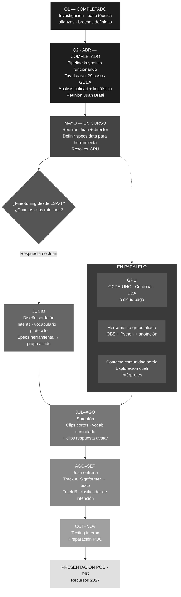

# Avatar AI — Roadmap 2026
**Última actualización: 17 mayo 2026**

---

```mermaid
flowchart TD

    Q1["Q1 — COMPLETADO\nInvestigación · base técnica\nalianzas · brechas definidas"]

    Q1 --> TOOL["Q2 · ABR — COMPLETADO\nPipeline keypoints funcionando\nToy dataset 29 casos GCBA\nAnálisis calidad + lingüístico\nReunión Juan Bratti"]

    TOOL --> JUAN["MAYO — EN CURSO\nReunión Juan + director\nDefinir specs data para herramienta\nResolver GPU"]

    JUAN --> DECISION{"¿Fine-tuning desde LSA-T?\n¿Cuántos clips mínimos?"}

    DECISION -->|Respuesta de Juan| DESIGN["JUNIO\nDiseño sordatón\nIntents · vocabulario · protocolo\nSpecs herramienta → grupo aliado"]

    DESIGN --> SORDAT["JUL–AGO\nSordatón\nClips cortos · vocab controlado\n+ clips respuesta avatar"]

    SORDAT --> TRAIN["AGO–SEP\nJuan entrena\nTrack A: Signformer → texto\nTrack B: clasificador de intención"]

    TRAIN --> TEST["OCT–NOV\nTesting interno\nPreparación POC"]

    TEST --> POC["PRESENTACIÓN POC · DIC\nRecursos 2027"]

    subgraph PARALELO ["EN PARALELO"]
        INFRA["GPU\nCCDE-UNC · Córdoba · UBA\no cloud pago"]
        HERRAMIENTA["Herramienta grupo aliado\nOBS + Python + anotación"]
        COMUNIDAD["Contacto comunidad sorda\nExploración cuali\nIntérpretes"]
    end

    JUAN -.-> PARALELO
    PARALELO -.-> SORDAT

    %% Estilos
    style Q1         fill:#1e1e1e,color:#fff,stroke:#1e1e1e
    style TOOL       fill:#1e1e1e,color:#fff,stroke:#1e1e1e
    style JUAN       fill:#444,color:#fff,stroke:#444
    style DECISION   fill:#555,color:#fff,stroke:#555
    style DESIGN     fill:#666,color:#fff,stroke:#666
    style SORDAT     fill:#777,color:#fff,stroke:#777
    style TRAIN      fill:#888,color:#fff,stroke:#888
    style TEST       fill:#a0a0a0,color:#fff,stroke:#a0a0a0
    style POC        fill:#e0e0e0,color:#222,stroke:#e0e0e0
    style PARALELO   fill:#3a3a3a,color:#fff,stroke:#555
    style INFRA      fill:#555,color:#fff,stroke:#555
    style HERRAMIENTA fill:#555,color:#fff,stroke:#555
    style COMUNIDAD  fill:#555,color:#fff,stroke:#555
```

---

## Estado por fase

| Fase | Período | Estado | Notas |
|---|---|---|---|
| Q1 — Investigación | Ene–Mar | ✅ Completado | Base técnica, alianzas, brechas |
| Pipeline + toy dataset | Abril | ✅ Completado | 29 casos, keypoints, análisis |
| Reunión Juan + director | Mayo | 🔄 En curso | Mensaje enviado |
| Diseño sordatón | Junio | ⏳ Pendiente | Depende de reunión Juan |
| Sordatón | Jul–Ago | ⏳ Pendiente | Intérpretes + herramienta |
| Entrenamiento | Ago–Sep | ⏳ Pendiente | GPU bloqueante |
| Testing + POC prep | Oct–Nov | ⏳ Pendiente | |
| POC | Diciembre | 🎯 Objetivo | Recursos 2027 |

---

## Decisiones estratégicas tomadas (mayo 2026)

**Path de datos:** Generar videos propios (Path B) — no curar existentes.
- Hapax legomena 61.8% en corpus GCBA existente → mismo problema que LSA-T
- Sordatón: vocabulario controlado, clips cortos (~5-10s), intent labels desde el diseño
- Un evento genera DOS outputs: clips de entrenamiento + clips de respuesta para el avatar

**Arquitectura del POC (dual-track):**
- **Track A:** keypoints → Signformer → texto en español (display)
- **Track B:** keypoints → clasificador de intención → agente acciona
- Track B es el salvaguarda: si la traducción falla, la intención se detecta igual

**Avatar para el POC:** simulado con videos pre-grabados en LSA (no síntesis generada por modelo).
El avatar generado por modelo propio es objetivo 2027.

**Métrica de éxito del POC:** intent accuracy, no BLEU.
Persona seña → sistema identifica intent → agente acciona → respuesta pre-grabada en LSA.

**Estrategia de entrenamiento:** curriculum learning — frases cortas primero, escalar gradualmente.

---

## Alianzas

| Alianza | Estado | Rol |
|---|---|---|
| Juan Bratti | 🔄 Activa | Entrenar modelo, asesorar formato |
| Grupo privado | 🔄 Activa | Herramienta captura + anotación (OBS+Python) |
| UNC / CCAD | 🔍 Posible GPU | Juan usó Nabucodonosor en su tesis |
| Universidad de Córdoba | 🔍 Exploración | Contacto de Matías, posible GPU |
| UBA | 🔍 Exploración | Inicial |
| UNLP | ❌ Inactiva | No respondieron. Posible: insistir a otro miembro |
| Microsoft GPU | ❌ Descartada | No se consiguió |

---

## Puntos de decisión GO / NO-GO

| Fecha | Pregunta | Si NO-GO |
|---|---|---|
| Fin mayo | ¿Reunión Juan define specs de data y confirma path? | Replantear con equipo |
| Fin junio | ¿Sordatón diseñada y herramienta especificada? | Riesgo timeline |
| Fin julio | ¿GPU resuelta + sordatón ejecutada? | POC diciembre en riesgo real |
| Fin septiembre | ¿Entrenamiento produce intent accuracy usable? | Evaluar si continuar |

---

## Bloqueantes activos (urgentes)

1. **GPU sin resolver** — crítico para que Juan pueda entrenar. Opciones: CCAD-UNC, Córdoba, UBA, cloud pago (Colab Pro / GCP).
2. **Specs herramienta → grupo aliado** — necesitan las especificaciones antes de seguir construyendo.
3. **Fecha de la sordatón** — sin fecha no existe. Target: julio o agosto.
4. **Rol de Jorge** — indefinido. Resolver: adentro con tarea concreta, o afuera del plan.

---

## Equipo

| Quién | Rol | Estado |
|---|---|---|
| Matías | PO/PM técnico — coordinación, dataset, agente | Activo |
| Juan Bratti (ext.) | Entrenamiento modelo, asesoría técnica | Activo (voluntario) |
| Sebastián | Comunidad sorda, intérpretes, pruebas usuarios | Activo |
| Jorge | — | Incierto |
| Grupo privado | Herramienta de captura y anotación | Activo |
